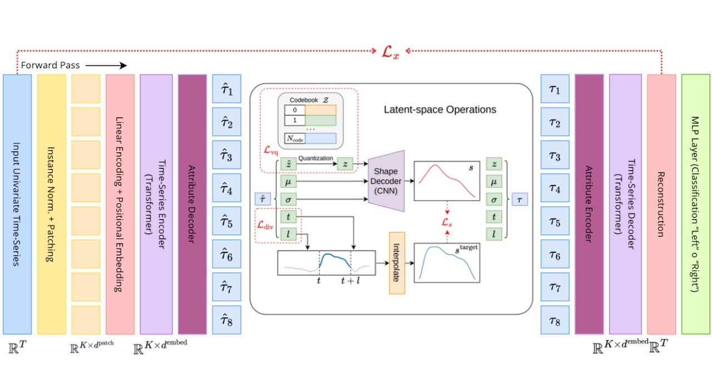

<div align="center">
    <h1>Finger Movements Classification Using VQShape Architecture</h1>
    <h3>Universidad Autónoma de Occidente 2025</h3>
    <p><strong>Lopez Juan Manuel, Botero William, Salamanca Danna</strong></p>
</div>

---

## Nombre de Articulo Base + Repositorio en Github Original

El siguiente trabajo está basado principalmente en el uso de la Arquitectura VQShape la cual es la responsable de realizar todo el proceso de reconstrucción de Series Temporales, entrenada en distintos datasets usando una generalización de formas de las subsecuencias, para así fomentar el uso de la arquitectura en cualquier ámbito que se desee trabajar, Desde Electrocardiogramas, hasta emociones del ser humano.

### Enlace al Articulo Original de la Arquitectura VQShape
#### [Abstracted Shapes as Tokens - A Generalizable and Interpretable Model for Time-series Classification](https://arxiv.org/pdf/2411.01006)

### Enlace al Repositorio de Github de VQShape
#### [Repositorio Arquitectura VQShape](https://github.com/YunshiWen/VQShape)

## 🧠 Descripción del Modelo
El Modelo VQShape es un modelo de Deep Learning para clasificación de Series Temporales, que combina autoencoders convencionales (*Encoder - Decoder*) con una capa de Cuantificación Vectorial (*Vector Quantization*) para lograr aprender representaciones dicretas y compactas del tiempo. Su arquitectura transforma la señal original en "códigos" discretos (*Embeddings Cuantizados*), lo que permite que esta capture patrones locales y globales, reduciendo el ruido y asi poder mejorar la robustez del clasificador final.

## 🚀 Principales Innovaciones
1. Muchos modelos convencionales, como las CNN (Convolutional Neural Networks) o las MLP (Multi-Layer Perceptron), son considerados *black-box models* porque, aunque pueden ofrecer excelentes resultados, las representaciones internas que producen no son interpretables para los seres humanos. La arquitectura VQShape busca solucionar precisamente este problema: permitir que los humanos comprendan mejor cómo se representan las formas de las subsecuencias en series temporales. Para lograrlo, VQShape utiliza Cuantificación Vectorial y un diccionario universal de subsecuencias (*Universal Codebook*), que actúa como un conjunto de “formas básicas” aprendidas previamente y que sirven para representar subsecuencias de manera más sencilla, consistente e interpretable.

2. Otro aspecto importante que aborda VQShape es la alta sensibilidad que tienen los modelos tradicionales frente al ruido o a pequeñas variaciones en las señales. En modelos como las CNN o las MLP, cualquier cambio mínimo en la serie puede alterar las representaciones internas y afectar la predicción. VQShape resuelve esto convirtiendo las subsecuencias en códigos discretos que provienen del diccionario universal. De esta forma, pequeñas fluctuaciones no cambian el código asignado, lo que hace que las representaciones sean más estables, más robustas y mucho más consistentes entre diferentes muestras.

3. Además, VQShape evita uno de los problemas más frecuentes en los modelos basados en autoencoders, como lo es el colapso del espacio latente. En modelos continuos, el encoder suele proyectar muchas subsecuencias a zonas muy cercanas, perdiendo diversidad. Con la Cuantificación Vectorial, VQShape obliga al modelo a utilizar distintos códigos del diccionario, manteniendo una representación más equilibrada y evitando que todos los patrones se agrupen en un solo lugar. Esto permite que las subsecuencias se distribuyan mejor y capturen diferentes formas presentes en la serie temporal.

4. Otro punto clave es que VQShape utiliza un diccionario compartido entre todas las muestras del dataset, lo que garantiza que subsecuencias parecidas siempre sean representadas de forma similar. En modelos tradicionales, dos señales casi iguales pueden terminar con representaciones muy diferentes debido a las características continuas aprendidas. Con el Universal Codebook, todas las series temporales usan las mismas “formas base”, lo que mejora la consistencia entre las representaciones y facilita comparar señales o entender patrones globales del dataset.

5. Finalmente, VQShape mejora la generalización del modelo al obligar a representar las subsecuencias de forma más abstracta y menos dependiente de detalles irrelevantes. Al usar códigos discretos, el modelo no se enfoca en pequeñas diferencias entre muestras, sino que captura patrones más generales y recurrentes. Esto reduce el riesgo de sobreajuste y hace que el modelo funcione mejor en señales nuevas, incluso si presentan cambios ligeros respecto a las muestras de entrenamiento.

## Resumen Teórico de la Arquitectura

<p align="center">
  
</p>


La arquitectura VQShape está diseñada para representar series temporales mediante formas discretas que se aprenden directamente del espacio latente. El proceso comienza con una serie temporal univariada, a la cual primero se le aplica Instance Normalization y luego se divide en pequeños segmentos llamados patches. Cada patch es transformado a un espacio de mayor dimensión usando una capa lineal con positional embedding, de manera que el modelo pueda capturar la información temporal y la posición relativa dentro de la serie. Estos embeddings se introducen en un Time-series Encoder basado en Transformer, que se encarga de extraer las características globales de la señal.

A partir de estas características, el Attribute Decoder predice un conjunto de atributos (*Representación Abstracta de la Forma, Desplazamiento, Escala, Posición Inicial Relativa y Longitud Relativa*) que describen la forma de cada subsecuencia. En paralelo, el modelo genera una representación latente continua que será cuantizada mediante un codebook discreto. Esta cuantización es lo que permite que cada subsecuencia sea representada por uno de los códigos del diccionario, haciendo que la representación final sea más estable, interpretable y robusta. El Desplazamiento y la Escala junto con el código seleccionado son enviados a un Shape Decoder basado en CNN, que reconstruye la forma estimada de la subsecuencia y permite comparar esta forma con una forma objetivo mediante la pérdida de forma (L_s).

Además, el modelo incluye una operación de interpolación que ajusta la forma generada dependiendo de los atributos predichos, especialmente la longitud, asegurando que las subsecuencias reconstruidas tengan proporciones coherentes con el segmento original de la serie temporal. En la parte final, el conjunto de códigos y atributos se vuelve a introducir en un Attribute Encoder y después en un Time-series Decoder (también basado en Transformer) para reconstruir la serie temporal completa. De esta manera, VQShape no solo aprende representaciones discretas e interpretables, sino que también es capaz de reconstruir la señal original, lo cual garantiza que el espacio latente conserve la información esencial de la serie.

Por ultimo, una vez se tiene la serie reconstruida, y se compara con la original para ver que tan bien se reconstrusye, esta serie para por una capa MLP para el proceso de Clasificación el cual nos permite ver que tan bien está reconstruyendo el modelo, respecto a la reconstrucción de la serie que hace en todo el proceso de la arquitectura.

##### A continuación, se va a explicar como hacer el proceso de instalación de este Repositorio, para poder trabajar un modelo de clasificación, usando la arquitectura vista de VQShape.

## 📋 Guía de Instalación y Ejecución

### 1. Clonar el repositorio
```bash
git clone https://github.com/willyoung21/VQShape_finger_classification.git
cd VQShape_finger_classification
```

### 2. Preparar los checkpoints de VQShape (⚠️ IMPORTANTE)

El repositorio **no contiene directamente** la carpeta `/checkpoints`, pero sí incluye un archivo comprimido:
 
**`uea_dim256_codebook512.zip`**

**Debes:**
- Descomprimirlo dentro de la carpeta `VQShape`
- Esto generará automáticamente la ruta necesaria: `VQShape/checkpoints/uea_dim256_codebook512/VQShape.ckpt`

**La estructura final debe quedar así:**
```
VQShape/
 └── checkpoints/
      └── uea_dim256_codebook512/
           └── VQShape.ckpt
```

> **Nota:** El modelo de clasificación EEG (`best_eeg_classifier.pt`) **sí está incluido** en el repositorio, dentro de:
> ```
> Modelo/best_eeg_classifier.pt
> ```
> Por lo tanto, no requiere instalación adicional.

---

### 3. Ejecutar la aplicación con Docker 🐳

El proyecto incluye un `Dockerfile` y un `docker-compose.yml`, por lo que solo necesitas ejecutar:
```bash
docker compose up --build
```

Esto construirá la imagen automáticamente:

✅ Instala Python 3.11  
✅ Instala dependencias desde `app/requirements.txt`  
✅ Copia el código dentro del contenedor  
✅ Configura el `PYTHONPATH` para VQShape  

Cuando termine el build, la app de **Streamlit** quedará disponible en:

🌐 **[http://localhost:8501](http://localhost:8501)**

---

### 4. ¿Necesito instalar `requirements.txt` localmente?

**❌ No.**

Debido a Docker:

- Todas las dependencias se instalan **dentro del contenedor**
- Tu máquina local **no necesita instalar nada** (ni Python ni pip)

**Solo si quisieras ejecutar la app sin Docker**, entonces sí tendrías que instalar:
```bash
pip install -r app/requirements.txt
```

Pero **no es necesario** para el flujo principal, ya que Docker gestiona todo.

---

## 🔧 ¿Cómo se cargan los pesos?

El archivo `app.py` carga dos modelos:

### 1️⃣ VQShape (tokenizador pretrained)

**Ruta generada después de descomprimir el ZIP:**
```
VQShape/checkpoints/uea_dim256_codebook512/VQShape.ckpt
```

**El modelo se carga así:**
```python
lit = LitVQShape.load_from_checkpoint(CHECKPOINT, map_location="cpu")
base_model = lit.model
```

> **Nota:** Luego se congela porque solo se utiliza para **inferencia**, no para entrenamiento.

---

### 2️⃣ Clasificador EEG (linear head)

**Este sí viene dentro del repo:**
```
Modelo/best_eeg_classifier.pt
```

**Y se carga con:**
```python
clf.load_state_dict(torch.load(CLASSIFIER_WEIGHTS, map_location="cpu"))
```

---

## 🧠 ¿Cómo funciona la inferencia?

### 📂 Datos de ejemplo

En el repositorio, dentro de la carpeta `VQShape/datos/FingerMovements`, están dos archivos `.ts`:

- `FingerMovements_TEST.ts` ✅ **(úsalo para pruebas)**
- `FingerMovements_TRAIN.ts` ⚠️ **(no usar para inferencia)**

---

### 🔄 Flujo de procesamiento

1. **Subes un archivo `.ts`** con señales EEG (por ejemplo, `FingerMovements_TEST.ts`)

2. **Se toma una muestra (trial)** del archivo

3. **Interpolación:** Se ajusta de **50 → 512 timesteps** para mantener compatibilidad con VQShape

4. **Tokenización:** VQShape convierte cada canal EEG en un **histograma de códigos** (512 dimensiones)

5. **Promediado:** Se promedian los histogramas de todos los canales

6. **Clasificación:** Ese vector de 512 valores entra al clasificador lineal

7. **Predicción final:** El modelo predice:
   - 👈 **LEFT** 
   - 👉 **RIGHT**

---

<div align="center">
    <p>Made with ❤️ by the UAO Team</p>
</div>